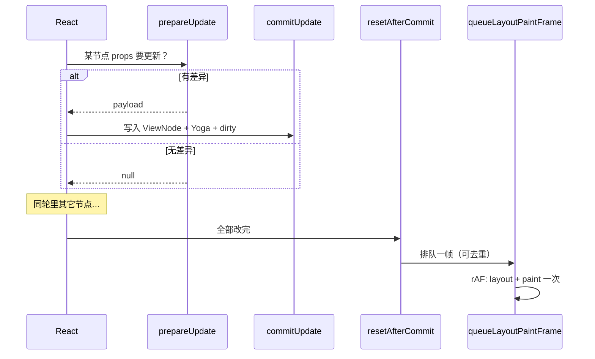

# HostConfig 速读（react-canvas）

宿主不是 DOM，而是 **ViewNode + Yoga + CanvasKit**。方法签名以 **`react-reconciler` 版本**为准；细节见 [phase-1-design.md §3](./phase-1-design.md)。**结构校验应落在下文 HostConfig 调用链上**，完整规则与检测点见 [runtime-structure-constraints.md](./runtime-structure-constraints.md)。

---

## 1. 整体在干什么？

**HostConfig 是什么？**  
React 改网页时会操作真 DOM；你这里没有 DOM，React 就改成 **一遍一遍调用你写好的函数**（创建节点、挂树、改 style、删掉……）。**这一组函数就叫 HostConfig**——可以理解为 **React 和你的场景树之间的接线说明**。

**「调用 HostConfig」是什么意思？**  
就是 React 按规则 **喊你干活**：「建一个 View」「把这个挂到父节点下面」「这个节点的 props 变了你更新一下」。**它不帮你画 Canvas**，只保证这些 **commit 阶段的调用**会发生。

**整件事其实只有两类改动：**

| 你想的              | 主要会调到                                                                            |
| ------------------- | ------------------------------------------------------------------------------------- |
| 树变了（增删挪）    | `createInstance`、`appendChild` / `appendInitialChild`、`insertBefore`、`removeChild` |
| 某个节点 props 变了 | `prepareUpdate` → 有变化才 `commitUpdate`                                             |

**为什么要 `resetAfterCommit`？**  
一轮更新里 React 可能 **很多次** `commitUpdate` / `appendChild`，你不知道哪次是最后一次。它保证：**这些全部做完之后，再调一次 `resetAfterCommit`**。  
名字容易误解成「重置」——心里把它当成 **`onHostMutationsFinished`（本轮改树结束了）** 就行。

**为什么要 `queueLayoutPaintFrame`？（你们自己起的函数名，不是 React API）**  
在 `resetAfterCommit` 里 **登记「下一帧再算布局 + 画一帧」**。

- **不和 React render 混**：React 只负责改数据；**什么时候算 Yoga、什么时候往像素里写，是你这边定的**。
- **用 rAF**：重活放到下一帧，**大致跟显示器刷新节拍对齐**，commit 阶段也更短。你也可以在 `resetAfterCommit` 里 **同步**算布局+画，能跑，但一般不如 rAF 稳。

**「去重」是什么？**  
短时间 **`queueLayoutPaintFrame` 被调了好几次**（例如多次 `resetAfterCommit`）时，用 `layoutPaintFrameQueued` 这类标记：**第一次才真正 `requestAnimationFrame`，后面的直接 return**，避免 **同一帧排好几个回调、布局和绘制跑多遍**。

---

## 2. 改 props：先算 diff，再写进树（别在 commit 里画）

- **`prepareUpdate`**：比较 `oldProps` / `newProps`。有变化就返回 **payload**（比如 `{ style: { width: 200 } }`），**没变化返回 `null`**。
- **`commitUpdate`**：**只有** payload 不是 `null` 才会调。在这里写 **ViewNode**、调 **Yoga setter**、可打 **`dirty`**。**这里不跑整树 `calculateLayout`，也不画 Skia。**
- **`resetAfterCommit`**：整轮 mutation 结束 → 调 **`queueLayoutPaintFrame()`**。
- **rAF 回调**：**一次**根上 **`calculateLayout` + `paintScene`**。

| 阶段           | 改 Yoga setter | `calculateLayout` | 画到屏幕 |
| -------------- | -------------- | ----------------- | -------- |
| `commitUpdate` | ✅ 要          | ❌                | ❌       |
| rAF 里         | 一般不再改     | ✅ 根上整树       | ✅       |

**`ViewNode.dirty`**：你自己打的标记（测试、以后优化用）。**Yoga 内部的脏**：引擎自己优化用。阶段一仍可从根算布局，两件事别混成一个概念就行。

---

## 3. 同一轮里改很多节点，会画很多次吗？

**不会（正常情况）。** 同一轮 commit 里 React 可能连续调很多次 `commitUpdate` / `appendChild` 等，**树和 Yoga 在这一轮里同步改完**；**画**还是：**一次 `resetAfterCommit` → `queueLayoutPaintFrame` 去重 → 最多一帧一次 layout + paint**。  
不要依赖「父一定先于子」之类的顺序，只要每个函数实现正确即可。

---

## 4. 批处理、`flushSync`、并发模式、Strict Mode

### 4.1 批处理（React 18）

一次点击里多个 `setState` 常 **合并成一次 commit** → 你这边通常也是 **一轮 HostConfig + 一次绘制调度**。

### 4.2 `flushSync`

会 **强行立刻提交**，可能 **多轮 commit** → 可能多帧绘制。`queueLayoutPaintFrame` 的 **去重**只能合并「同一帧里重复排队」，**合并不了跨帧**。

### 4.3 并发模式是什么？有什么用？

**是什么：**  
React 可以把「算出新 UI 长什么样」（render）和「真的落到宿主上」（commit）**拆开**。它允许 **先算、再决定要不要用**：紧急的更新（例如输入框打字）可以 **插队**；很重的更新（例如大列表）可以 **等浏览器有空再做**，中间还能 **取消或重做** 还没交上去的那一版计算。

**用途（为什么要有）：**  
避免「一个大更新卡死界面」——用户操作时界面仍能尽快响应。对浏览器 DOM，React 会自己控制何时提交；对你这种自定义宿主，**规则一样**：**没走到 commit 的那几次 render，都不该动 ViewNode / Yoga**。

**对你实现 HostConfig 意味着什么：**

- **只有已经 commit 的更新**会调用 `commitUpdate`、`appendChild` 等；这些调用发生时，场景树应当与「当前已提交的 React 树」一致。
- **不要在组件函数体（render）里直接改场景树**；只应在 HostConfig 的 **commit 路径**里改。
- 某次低优先级更新 **后来被扔掉** 了：你的宿主 **从来没收到过** 对应 mutation，**不需要回滚**。
- 一旦 commit，后面仍是 **`resetAfterCommit` → `queueLayoutPaintFrame` → rAF** 画一帧，和是否开启并发无关。

（是否启用并发、如何用 `startTransition` 等，由上层 React / `createRoot` 的用法决定；自定义 Reconciler 按 `react-reconciler` 的配置接入即可。）

### 4.4 Strict Mode（开发环境）

可能 **故意多挂、多卸** 帮你找副作用：**`createInstance` / `removeChild` + destroy** 要能 **重复执行**、**不泄漏** WASM。

---

## 5. 典型场景（一眼看完）

| 情况             | 大致顺序                                                                                                                   |
| ---------------- | -------------------------------------------------------------------------------------------------------------------------- |
| **第一次出现**   | `createInstance` → `appendChild`（等）→ `resetAfterCommit` → `queueLayoutPaintFrame` → rAF。新建节点不走 `prepareUpdate`。 |
| **只改 style**   | `prepareUpdate` →（有 payload）`commitUpdate` → … → `resetAfterCommit` → `queueLayoutPaintFrame` → rAF。                   |
| **又改父又加子** | 同一轮里穿插 `commitUpdate` / `createInstance` / `appendChild`，最后仍是一次 `resetAfterCommit` + 排队绘制。               |
| **删掉子节点**   | `removeChild` + `destroy` / Yoga `free`，再 `resetAfterCommit` → `queueLayoutPaintFrame`。                                 |

---

## 6. 其它 HostConfig 是干嘛的？（阶段一怎么糊弄）

不是第三种业务，多是 **规则、边界、空钩子**：

| 方法                                                               | 用途（是干嘛的）                                | 阶段一常见                 |
| ------------------------------------------------------------------ | ----------------------------------------------- | -------------------------- |
| `prepareForCommit`                                                 | commit 开始前                                   | 空函数                     |
| `resetAfterCommit`                                                 | commit 结束，**你去排队绘制**                   | 调 `queueLayoutPaintFrame` |
| `getRootHostContext` / `getChildHostContext`                       | 往下传「宿主自己的上下文」（不是 `useContext`） | 透传                       |
| `createTextInstance` / `commitTextUpdate` / `shouldSetTextContent` | 文本                                            | 无文本可抛错 / `false`     |
| `finalizeInitialChildren`                                          | 首屏子挂完要问一句                              | `false`                    |
| `getPublicInstance`                                                | ref 指向谁                                      | 返回实例                   |
| `clearContainer`                                                   | 根被清空                                        | 释放树                     |
| `supportsMutation`                                                 | 可变宿主                                        | `true`                     |

其余按类型定义 **stub**；Portal / Suspense 等用到了再填。

---

## 7. 一句话速查

**改树 / 改 props 都在 commit 里把 ViewNode + Yoga 对齐；不画。等 `resetAfterCommit` 再 `queueLayoutPaintFrame`（去重 + rAF）画一轮。React 只保证会按合同调你，不管你怎么画、何时画。**
