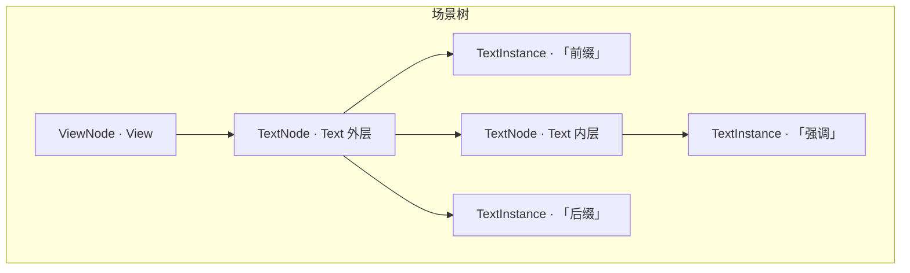
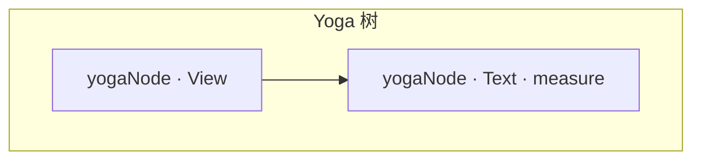

# React 场景树与 Yoga 树对照（含 Text 嵌套 Text）

本文说明 `@react-canvas` 里 **Reconciler 场景节点**（`ViewNode` / `TextNode`）与 **Yoga 布局树** 的对应关系，以及 **测量 → 绘制** 时宽度如何传递。可与 [runtime-structure-constraints.md](./runtime-structure-constraints.md)（R-HOST-2 / R-HOST-3 / R-HOST-4）一起读。**换行、行高、`MeasureMode` 细节**见 [text-line-wrapping.md](../core/text-line-wrapping.md)。

---

## 1. 两套树分别管什么

|                | **场景树**（Reconciler 产物）                  | **Yoga 树**（布局引擎）                                    |
| -------------- | ---------------------------------------------- | ---------------------------------------------------------- |
| **职责**       | 完整反映 JSX：谁包谁、字串与嵌套 `Text` 的顺序 | 只做 flex：盒子宽高、padding、子节点在主轴上的分配         |
| **节点**       | `ViewNode`、`TextNode`、字符串 `TextInstance`  | 基本只有 **`View`** 与 **最外层 `Text`** 对应的 `yogaNode` |
| **谁更「全」** | 更全                                           | 更瘦：嵌套 `Text` **不**增加 Yoga 子节点                   |

**结论**：场景树 ⊃ Yoga 树；**不是**每个 React 宿主节点都在 Yoga 里占一格。

---

## 2. Yoga 里有哪些类型的节点

在实现上，只有 **`ViewNode` 通过 `View.appendChild`** 时会把子节点的 `yogaNode` **挂到父 `yogaNode`**（`insertChild`）。

**`TextNode` 里再挂子 `TextNode`** 时：**不会**调用 `parent.yogaNode.insertChild(child.yogaNode)`，子节点 `yogaMounted = false`（见 `packages/core/src/text-node.ts`）。

因此 Yoga 侧可以概括为：

1. **`View` 对应节点**：普通 flex 子树，可继续挂 `View` 或外层 `Text`。
2. **外层 `Text` 对应节点**：一个 **带 `setMeasureFunc` 的叶子**；宽高由内部 Skia `Paragraph` 测量。
3. **不在 Yoga 里出现的**：字符串叶子、**内层** `TextNode`（仅参与场景树与 span 展平）。

---

## 3. 节点图：View → Text（嵌套 Text + 字串）

### 3.1 示例 JSX

```tsx
<View style={{ flexDirection: "column", padding: 16 }}>
  <Text style={{ fontSize: 15, color: "#cbd5e1" }}>
    前缀
    <Text style={{ color: "#38bdf8" }}>强调</Text>
    后缀
  </Text>
</View>
```

### 3.2 场景树（逻辑结构）



外层 `TextNode` 用 **`slots`** 保存顺序：`string → 嵌套 TextNode → string`。内层 `TextNode` 只挂在外层 `children` / `slots` 上，**不**挂到 Yoga。

### 3.3 Yoga 树（布局结构）



仅 **两个** Yoga 节点；内层 `Text` 与三段子串 **均不出现**。

### 3.4 文本对照

```text
场景树（全）                         Yoga 树（布局）
───────────────────                  ─────────────────
ViewNode                             yoga.View
└─ TextNode（外层）           ↔      └─ yoga.Text（setMeasureFunc）
   ├─ TextInstance                       （无子 yoga）
   ├─ TextNode（内层）  ──✗ 不挂载
   └─ TextInstance
```

---

## 4. 嵌套 Text：数据如何变成一段排版

1. **样式继承**：`mergeTextProps` 自顶向下合并；内层 `Text` 覆盖同名属性。
2. **展平**：`collectParagraphSpans` 得到 **`ParagraphSpan[]`**（每段 `{ style, text }`）。
3. **一次排版**：`buildParagraphFromSpans` + `Paragraph.layout(内容宽度)`；**换行在 Skia 内完成**，不是 Yoga 按字符切。
4. **只有外层** `TextNode` 参与 **Yoga measure**；内层只影响 span 列表。

---

## 5. 宽度与换行（分工）

Yoga 只给 **`Text` 盒子**宽度；**自动折行**在 Skia **`Paragraph.layout(内容区最大宽度)`** 内完成。数据流：`父宽 → innerW（减 padding）→ layout → 回传 measure 尺寸`；绘制阶段对 **同一 innerW** 再 `layout` 一次以保证一致。

**完整说明**（`MeasureMode`、`lineHeight`、`numberOfLines`、`\n` 等）：[text-line-wrapping.md](../core/text-line-wrapping.md)。

---

## 6. 与 React Native 的类比

RN 也支持 `<Text>` 嵌套 `<Text>`；flex 树上通常仍是 **外层 Text 占一个度量单元**，内层在原生侧展成 **带属性的连续文本**。本仓库用 **Skia Paragraph + 多 span** 达到同类效果。

---

## 7. 源码索引

| 主题                                                  | 路径                                                   |
| ----------------------------------------------------- | ------------------------------------------------------ |
| `slots`、嵌套 `Text`、`yogaMounted`、`setMeasureFunc` | `packages/core/src/text-node.ts`                       |
| `View` 对子节点 `yogaNode.insertChild`                | `packages/core/src/view-node.ts`                       |
| `collectParagraphSpans`、span 展平                    | `packages/core/src/text-node.ts`                       |
| `Paragraph` 构建、`layout`、`measureParagraphSpans`   | `packages/core/src/paragraph-build.ts`                 |
| 换行、行高、`MeasureMode`（文档）                     | [text-line-wrapping.md](../core/text-line-wrapping.md) |
| `calculateLayoutRoot`、同步 `layout`                  | `packages/core/src/layout.ts`                          |
| `drawParagraph`                                       | `packages/core/src/paint.ts`                           |
